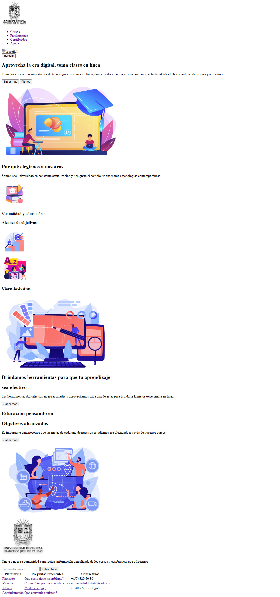
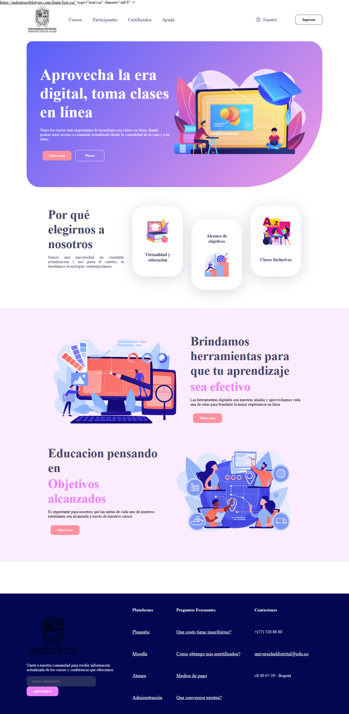

<h1>Taller 9: Katerine Triana</h1>

<h2>Informacion</h2>

Curso: Full Stack Basico - Grupo 1

Profesor: Cristian Patiño

<h2>Punto 1: Link de Figma</h2>
<a href="https://www.figma.com/file/QDUJ3G0cRozozbcmGZHL7G/Katerine-Triana-Figma-Exercise?type=design&node-id=6%3A1246&t=NVSzBQTxOAV4UjZg-1"> Link de Figma</a> 

<h2>Punto 2: HTML</h2>

<h2>Punto 3: css</h2>
 